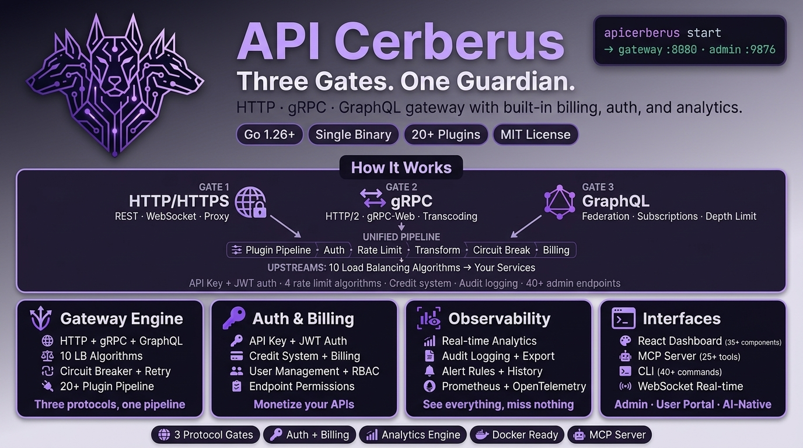

# APICerebrus

<p align="center">
  
</p>

<p align="center">
  <a href="https://go.dev/"></a>
  <a href="./LICENSE"></a>
  <a href="#"></a>
  <a href="#"></a>
  <a href="#"></a>
</p>

<p align="center">
  <b>A production-ready API Gateway built in Go with enterprise-grade features</b>
</p>

---

## Table of Contents

- [Overview](#overview)
- [Features](#features)
- [Architecture](#architecture)
- [Quick Start](#quick-start)
- [Configuration](#configuration)
- [API Documentation](#api-documentation)
- [CLI Reference](#cli-reference)
- [Contributing](#contributing)
- [License](#license)

---

## Overview

APICerebrus is a high-performance, production-ready API Gateway built in Go. It provides comprehensive API management capabilities including intelligent routing, authentication, rate limiting, billing/credits, audit logging, and clustering - all with a modern React-based admin dashboard.

### Key Statistics

| Metric | Value |
|--------|-------|
| Go Source Files | 179 |
| Test Files | 235 |
| Packages | 39 |
| Lines of Code | ~55,700 (production Go) |
| CLI Commands | 14+ (with subcommands) |
| Admin API Endpoints | 90+ |
| MCP Tools | 43 |

---

## Features

### Core Gateway

| Feature | Description | Status |
|---------|-------------|--------|
| HTTP/HTTPS Reverse Proxy | High-performance request forwarding with keep-alive | ✅ |
| WebSocket Support | Full bidirectional WebSocket proxying | ✅ |
| Radix Tree Router | O(k) path matching with parameter extraction | ✅ |
| 11 Load Balancing Algorithms | Round Robin, Weighted Round Robin, Least Connections, IP Hash, Consistent Hash, Adaptive, Least Latency, Health Weighted, SubnetAware, Weighted Least Connections, Random | ✅ |
| Health Checks | Active and passive health monitoring | ✅ |
| Circuit Breaker | Automatic failure detection and recovery | ✅ |
| Request/Response Transforms | Header/body modification and validation | ✅ |
| Compression | Gzip/Brotli response compression | ✅ |

### Authentication & Security

| Feature | Description | Status |
|---------|-------------|--------|
| API Key Authentication | SQLite-backed with `ck_live_`/`ck_test_` prefixes | ✅ |
| JWT Support | HS256, RS256, JWKS | ✅ |
| Rate Limiting | 4 algorithms (Token Bucket, Fixed Window, Sliding Window, Leaky Bucket) | ✅ |
| Distributed Rate Limiting | Redis-backed for multi-node deployments | ✅ |
| IP Restrictions | Whitelist/blacklist with CIDR support | ✅ |
| CORS | Configurable cross-origin resource sharing | ✅ |
| Bot Detection | Automated bot identification and blocking | ✅ |
| Certificate Management | ACME/Let's Encrypt auto-provisioning | ✅ |

### Data & Management

| Feature | Description | Status |
|---------|-------------|--------|
| SQLite Backend | WAL mode for high concurrency | ✅ |
| Credit System | Atomic transactions with test key bypass | ✅ |
| User Management | Roles, permissions, IP whitelisting | ✅ |
| Endpoint Permissions | Time and day-based access restrictions | ✅ |
| Audit Logging | Field masking, GZIP compression, retention policies | ✅ |
| Analytics Engine | Real-time metrics and time-series data | ✅ |
| OpenTelemetry Tracing | Distributed tracing support | ✅ |

### Advanced Features

| Feature | Description | Status |
|---------|-------------|--------|
| GraphQL Federation | Apollo-compatible schema composition | ✅ |
| GraphQL Subscriptions | Real-time GraphQL subscriptions | ✅ |
| gRPC Support | HTTP/2, gRPC-Web, HTTP transcoding | ✅ |
| Raft Clustering | Distributed consensus for HA deployments | ✅ |
| Multi-region Clustering | Geographic distribution support | ✅ |
| MCP Server | Model Context Protocol (stdio + SSE) | ✅ |
| WebAssembly Plugins | Extensible WASM plugin support | ✅ |
| Kafka Integration | Audit log streaming to Kafka | ✅ |
| Plugin Marketplace | Discover and install plugins | ✅ |

### Interfaces

| Feature | Description | Status |
|---------|-------------|--------|
| Admin REST API | 70+ endpoints for management (port 9876) | ✅ |
| Web Dashboard | React + Vite + Tailwind v4 + shadcn/ui | ✅ |
| User Portal | API Playground and self-service (port 9877) | ✅ |
| WebSocket Real-time | Live updates and notifications | ✅ |
| CLI Tool | 40+ commands for administration | ✅ |
| MCP Tools | 43 tools for AI integration | ✅ |

---

## Architecture

```
┌─────────────────────────────────────────────────────────────────────────────┐
│                              APICerebrus Gateway                            │
├─────────────────────────────────────────────────────────────────────────────┤
│  ┌─────────────┐  ┌─────────────┐  ┌─────────────┐  ┌─────────────────────┐ │
│  │   HTTP/1.1  │  │   HTTP/2    │  │   WebSocket │  │        gRPC         │ │
│  │   Server    │  │   Server    │  │   Server    │  │       Server        │ │
│  └──────┬──────┘  └──────┬──────┘  └──────┬──────┘  └──────────┬──────────┘ │
│         └─────────────────┴─────────────────┴────────────────────┘           │
│                                    │                                         │
│                           ┌────────▼────────┐                                │
│                           │  Radix Router   │                                │
│                           │   O(k) Match    │                                │
│                           └────────┬────────┘                                │
│                                    │                                         │
│                    ┌───────────────┼───────────────┐                        │
│                    ▼               ▼               ▼                        │
│              ┌──────────┐   ┌──────────┐   ┌──────────┐                     │
│              │  Plugin  │   │   Auth   │   │  Rate    │                     │
│              │ Pipeline │   │  Engine  │   │  Limit   │                     │
│              └────┬─────┘   └────┬─────┘   └────┬─────┘                     │
│                   └──────────────┼──────────────┘                           │
│                                  │                                          │
│                         ┌────────▼────────┐                                 │
│                         │ Load Balancer   │                                 │
│                         │ (11 algorithms) │                                 │
│                         └────────┬────────┘                                 │
│                                  │                                          │
│                         ┌────────▼────────┐                                 │
│                         │  Upstream Pool  │                                 │
│                         │ Health Checked  │                                 │
│                         └─────────────────┘                                 │
├─────────────────────────────────────────────────────────────────────────────┤
│                              Admin & Portal                                 │
│  ┌─────────────────┐  ┌─────────────────┐  ┌─────────────────────────────┐  │
│  │   Admin API     │  │   User Portal   │  │   Web Dashboard (React)     │  │
│  │   (Port 9876)   │  │   (Port 9877)   │  │   Embedded SPA              │  │
│  └─────────────────┘  └─────────────────┘  └─────────────────────────────┘  │
├─────────────────────────────────────────────────────────────────────────────┤
│                              Data Layer                                     │
│  ┌─────────────┐  ┌─────────────┐  ┌─────────────┐  ┌─────────────────────┐ │
│  │   SQLite    │  │   Redis     │  │   Kafka     │  │   Raft Consensus    │ │
│  │  (WAL Mode) │  │  (Optional) │  │  (Optional) │  │   (Clustering)      │ │
│  └─────────────┘  └─────────────┘  └─────────────┘  └─────────────────────┘ │
└─────────────────────────────────────────────────────────────────────────────┘
```

### Request Flow

```
Client Request
      │
      ▼
┌─────────────┐
│   Gateway   │◄─── Plugin Pipeline (Auth, Rate Limit, Transform)
│   Router    │
└──────┬──────┘
       │
       ▼
┌─────────────┐
│ Load Balancer│◄─── Health Checks, 11 Algorithms
└──────┬──────┘
       │
       ▼
┌─────────────┐
│  Upstream   │◄─── Audit Log, Analytics, Billing
│   Target    │
└─────────────┘
```

---

## Quick Start

### Prerequisites

- Go 1.26+
- Node.js 20+ (for web dashboard build)
- Make (optional, for convenience)

### Installation

```bash
# Clone the repository
git clone https://github.com/APICerberus/APICerebrus.git
cd APICerebrus

# Build (includes web dashboard)
make build

# Or build without web dashboard
go build -o bin/apicerberus ./cmd/apicerberus
```

### Configuration

```bash
# Copy example configuration
cp apicerberus.example.yaml apicerberus.yaml

# Edit configuration
nano apicerberus.yaml
```

### Running

```bash
# Start the gateway
./bin/apicerberus start --config apicerberus.yaml

# Check admin status
curl -H "X-Admin-Key: change-me" http://127.0.0.1:9876/admin/api/v1/status

# Access web dashboard
open http://127.0.0.1:9876/dashboard
```

### Docker

```bash
# Build Docker image
docker build -t apicerberus:latest .

# Run with Docker
docker run -p 8080:8080 -p 9876:9876 -p 9877:9877 \
  -v $(pwd)/apicerberus.yaml:/etc/apicerberus/config.yaml \
  apicerberus:latest
```

---

## Configuration

### Minimal Configuration

```yaml
gateway:
  http_addr: ":8080"

admin:
  addr: ":9876"
  api_key: "your-secure-api-key"

store:
  path: "apicerberus.db"

services:
  - name: "my-service"
    upstream: "my-upstream"

routes:
  - name: "api-route"
    service: "my-service"
    paths:
      - "/api/*"

upstreams:
  - name: "my-upstream"
    algorithm: "round_robin"
    targets:
      - address: "localhost:3000"
```

### Full Configuration Example

See [`apicerberus.example.yaml`](./apicerberus.example.yaml) for a comprehensive configuration example including:

- TLS/ACME configuration
- gRPC and WebSocket settings
- Rate limiting and billing
- Audit logging and retention
- Redis for distributed rate limiting
- OpenTelemetry tracing
- Plugin configuration

---

## API Documentation

### Admin API

The Admin API is protected by the `X-Admin-Key` header.

Base URL: `http://localhost:9876/admin/api/v1`

#### Core Endpoints

| Method | Endpoint | Description |
|--------|----------|-------------|
| GET | `/status` | Gateway status and health |
| GET | `/info` | Version and build info |
| POST | `/config/reload` | Hot reload configuration |
| GET | `/config/export` | Export current configuration |
| POST | `/config/import` | Import configuration |
| WS | `/ws` | Real-time WebSocket updates |

#### Gateway Management

| Method | Endpoint | Description |
|--------|----------|-------------|
| GET | `/services` | List all services |
| POST | `/services` | Create service |
| GET | `/services/{id}` | Get service details |
| PUT | `/services/{id}` | Update service |
| DELETE | `/services/{id}` | Delete service |
| GET | `/routes` | List all routes |
| POST | `/routes` | Create route |
| GET | `/routes/{id}` | Get route details |
| PUT | `/routes/{id}` | Update route |
| DELETE | `/routes/{id}` | Delete route |
| GET | `/upstreams` | List all upstreams |
| POST | `/upstreams` | Create upstream |
| GET | `/upstreams/{id}` | Get upstream details |
| PUT | `/upstreams/{id}` | Update upstream |
| DELETE | `/upstreams/{id}` | Delete upstream |
| POST | `/upstreams/{id}/targets` | Add target |
| DELETE | `/upstreams/{id}/targets/{tid}` | Remove target |
| GET | `/upstreams/{id}/health` | Health status |

#### User Management

| Method | Endpoint | Description |
|--------|----------|-------------|
| GET | `/users` | List users |
| POST | `/users` | Create user |
| GET | `/users/{id}` | Get user |
| PUT | `/users/{id}` | Update user |
| DELETE | `/users/{id}` | Delete user |
| POST | `/users/{id}/suspend` | Suspend user |
| POST | `/users/{id}/activate` | Activate user |
| POST | `/users/{id}/reset-password` | Reset password |
| GET | `/users/{id}/api-keys` | List API keys |
| POST | `/users/{id}/api-keys` | Create API key |
| DELETE | `/users/{id}/api-keys/{keyId}` | Revoke API key |
| GET | `/users/{id}/permissions` | List permissions |
| POST | `/users/{id}/permissions` | Grant permission |
| PUT | `/users/{id}/permissions/{pid}` | Update permission |
| DELETE | `/users/{id}/permissions/{pid}` | Revoke permission |
| GET | `/users/{id}/ip-whitelist` | List IP whitelist |
| POST | `/users/{id}/ip-whitelist` | Add IP to whitelist |
| DELETE | `/users/{id}/ip-whitelist/{ip}` | Remove IP |

#### Credit Management

| Method | Endpoint | Description |
|--------|----------|-------------|
| GET | `/credits/overview` | Credit system overview |
| GET | `/users/{id}/credits/balance` | User credit balance |
| POST | `/users/{id}/credits/topup` | Add credits |
| POST | `/users/{id}/credits/deduct` | Deduct credits |
| GET | `/users/{id}/credits/transactions` | Transaction history |

#### Audit & Analytics

| Method | Endpoint | Description |
|--------|----------|-------------|
| GET | `/audit-logs` | Search audit logs |
| GET | `/audit-logs/{id}` | Get audit log detail |
| GET | `/audit-logs/export` | Export audit logs |
| GET | `/audit-logs/stats` | Audit statistics |
| DELETE | `/audit-logs/cleanup` | Cleanup old logs |
| GET | `/analytics/overview` | Analytics overview |
| GET | `/analytics/timeseries` | Time-series data |
| GET | `/analytics/top-routes` | Top routes by traffic |
| GET | `/analytics/top-consumers` | Top consumers |
| GET | `/analytics/errors` | Error analytics |
| GET | `/analytics/latency` | Latency metrics |
| GET | `/analytics/throughput` | Throughput metrics |
| GET | `/analytics/status-codes` | Status code distribution |

#### Billing Configuration

| Method | Endpoint | Description |
|--------|----------|-------------|
| GET | `/billing/config` | Get billing config |
| PUT | `/billing/config` | Update billing config |
| GET | `/billing/route-costs` | Get route costs |
| PUT | `/billing/route-costs` | Update route costs |

#### GraphQL Federation

| Method | Endpoint | Description |
|--------|----------|-------------|
| GET | `/subgraphs` | List subgraphs |
| POST | `/subgraphs` | Add subgraph |
| GET | `/subgraphs/{id}` | Get subgraph |
| DELETE | `/subgraphs/{id}` | Remove subgraph |
| POST | `/subgraphs/compose` | Compose schemas |

#### Alerts

| Method | Endpoint | Description |
|--------|----------|-------------|
| GET | `/alerts` | List alert rules |
| POST | `/alerts` | Create alert rule |
| PUT | `/alerts/{id}` | Update alert rule |
| DELETE | `/alerts/{id}` | Delete alert rule |
| GET | `/alerts/history` | Alert history |

### Example Requests

```bash
# Get gateway status
curl -H "X-Admin-Key: change-me" \
  http://localhost:9876/admin/api/v1/status

# Create a new service
curl -X POST \
  -H "X-Admin-Key: change-me" \
  -H "Content-Type: application/json" \
  -d '{
    "id": "user-service",
    "name": "user-service",
    "protocol": "http",
    "upstream": "user-upstream"
  }' \
  http://localhost:9876/admin/api/v1/services

# List users
curl -H "X-Admin-Key: change-me" \
  http://localhost:9876/admin/api/v1/users

# Top up user credits
curl -X POST \
  -H "X-Admin-Key: change-me" \
  -H "Content-Type: application/json" \
  -d '{
    "amount": 1000,
    "reason": "Monthly allocation"
  }' \
  http://localhost:9876/admin/api/v1/users/123/credits/topup

# Search audit logs
curl -H "X-Admin-Key: change-me" \
  "http://localhost:9876/admin/api/v1/audit-logs?user=123&since=2024-01-01"
```

See [API.md](./API.md) for complete API documentation.

---

## CLI Reference

APICerebrus includes a comprehensive CLI for administration.

### Core Commands

```bash
# Gateway management
apicerberus start [--config path] [--pid-file path]
apicerberus stop [--pid-file path]
apicerberus version
apicerberus config validate <path>

# Configuration
apicerberus config export [--config path] [--out path]
apicerberus config import [--target path] <source>
apicerberus config diff <path1> <path2>
```

### User Management

```bash
apicerberus user list [--config path] [--output json]
apicerberus user create --email <email> --name <name> [--credits <n>] [--role <role>]
apicerberus user get <id> [--config path] [--output json]
apicerberus user update <id> [--name <name>] [--rate-limit-rps <n>]
apicerberus user suspend|activate <id>
apicerberus user apikey list --user <id>
apicerberus user apikey create --user <id> --name <name> [--mode test|live]
apicerberus user apikey revoke --user <id> --key <key-id>
apicerberus user permission list --user <id>
apicerberus user permission grant --user <id> --route <route> --methods <methods>
apicerberus user permission revoke --user <id> --permission <id>
apicerberus user ip list --user <id>
apicerberus user ip add --user <id> --ip <cidr>
apicerberus user ip remove --user <id> --ip <cidr>
```

### Credit Management

```bash
apicerberus credit overview [--config path] [--output json]
apicerberus credit balance --user <id>
apicerberus credit topup --user <id> --amount <n> --reason <text>
apicerberus credit deduct --user <id> --amount <n> --reason <text>
apicerberus credit transactions --user <id>
```

### Audit & Analytics

```bash
apicerberus audit search [--config path] [--output json] [--user <id>] [--route <route>] [--since <date>]
apicerberus audit tail [--config path] [--follow]
apicerberus audit detail <id>
apicerberus audit export [--format csv|json|jsonl]
apicerberus audit stats
apicerberus audit cleanup --older-than-days <n>
apicerberus audit retention show|set --days <n>
apicerberus analytics overview [--config path] [--output json]
apicerberus analytics requests [--config path]
apicerberus analytics latency [--config path]
```

### Gateway Entities

```bash
apicerberus service list|add|get|update|delete
apicerberus route list|add|get|update|delete
apicerberus upstream list|add|get|update|delete
```

### MCP Server

```bash
apicerberus mcp start [--transport stdio|sse] [--port 3000] [--config path]
```

---

## Project Structure

```
apicerberus/
├── cmd/apicerberus/          # Application entrypoint
├── internal/
│   ├── admin/                # Admin REST API
│   ├── analytics/            # Metrics and analytics
│   ├── audit/                # Audit logging
│   ├── billing/              # Credit system
│   ├── certmanager/          # TLS certificate management
│   ├── cli/                  # CLI commands
│   ├── config/               # Configuration parsing
│   ├── federation/           # GraphQL Federation
│   ├── gateway/              # Core gateway (router, proxy, balancer)
│   ├── graphql/              # GraphQL support
│   ├── grpc/                 # gRPC server and transcoding
│   ├── loadbalancer/         # Load balancing algorithms
│   ├── logging/              # Logging utilities
│   ├── mcp/                  # MCP server implementation
│   ├── metrics/              # Prometheus metrics
│   ├── pkg/                  # Shared packages (jwt, yaml, uuid, json)
│   ├── plugin/               # Plugin system (20+ plugins)
│   ├── portal/               # User portal handlers
│   ├── raft/                 # Raft clustering
│   ├── ratelimit/            # Rate limiting algorithms
│   ├── store/                # SQLite repositories
│   ├── tracing/              # OpenTelemetry tracing
│   └── version/              # Version information
├── web/                      # React dashboard (Vite + Tailwind v4)
├── test/                     # E2E and integration tests
├── docs/                     # Documentation
├── scripts/                  # Operational scripts
└── deployments/              # Docker, Helm, Swarm configs
```

---

## Testing

```bash
# Run all tests
go test ./...

# Run with race detection
go test -race ./...

# Run with coverage
make coverage

# Run integration tests
go test -tags=integration ./test/...

# Run E2E tests
go test -tags=e2e ./test/...

# Run benchmarks
go test -bench=. -benchmem ./...
```

---

## Contributing

We welcome contributions! Please see [docs/CONTRIBUTING.md](./docs/CONTRIBUTING.md) for guidelines.

### Development Setup

```bash
# Fork and clone
git clone https://github.com/APICerberus/APICerebrus.git
cd APICerebrus

# Install dependencies
go mod download
cd web && npm install && cd ..

# Run tests
make test

# Build
make build
```

### Commit Convention

We follow conventional commits:

- `feat:` New features
- `fix:` Bug fixes
- `docs:` Documentation changes
- `test:` Test additions/changes
- `refactor:` Code refactoring
- `perf:` Performance improvements
- `chore:` Build/tooling changes

---

## Roadmap

Completed milestones:

- `v0.1.0`: Core gateway, routing, load balancing
- `v0.2.0`: gRPC support (HTTP/2, gRPC-Web, transcoding)
- `v0.3.0`: GraphQL support (query depth, complexity, subscriptions)
- `v0.4.0`: GraphQL Federation (schema composition, query planning)
- `v0.5.0`: Raft Clustering (HA, distributed rate limiting)
- `v0.6.0`: Advanced features (caching, Prometheus, OpenTelemetry)
- `v0.7.0`: Enterprise (RBAC, SSO, white-label)
- `v1.0.0-rc.1`: Release candidate with CI/CD and documentation (targeting production readiness)

See [`.project/TASKS.md`](./.project/TASKS.md) for detailed roadmap.

---

## License

APICerebrus is licensed under the [MIT License](./LICENSE).

---

## Support

- Documentation: [docs/](./docs/)
- Issues: [GitHub Issues](https://github.com/APICerberus/APICerebrus/issues)
- Discussions: [GitHub Discussions](https://github.com/APICerberus/APICerebrus/discussions)

---

<p align="center">
  Built with ❤️ by the APICerebrus team
</p>
